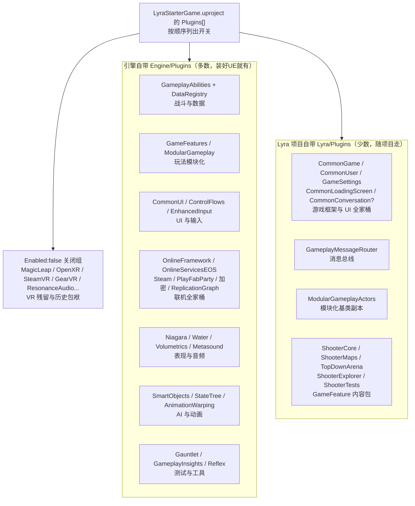

# 01a — Lyra 的 Plugins 逐个拆解：它们都是干嘛的、是 UE5 自带的吗？

> **定位**：上一篇 `01` 讲了 `.uproject` 里 `Plugins` 数组怎么写。这一篇拿着 UE5.6 版 Lyra 的**真实 `.uproject` 原文件**，从第 1 个到最后一个，按顺序告诉你：每个插件干嘛的、是引擎自带还是 Lyra 自带、以及哪些是关着的（`Enabled: false`）。

---

## 一、先看原文件结构：Plugins 数组长什么样

Lyra 5.6 的 `LyraStarterGame.uproject` 里，`Modules` 之后跟了一长串 `Plugins`。它们的开关写法有 4 种（这就是 `01` 篇字段的实战复习）：

| 写法 | 含义 | 例子 |
|---|---|---|
| `{ "Name": "xxx", "Enabled": true }` | 启用 | `GameplayAbilities` |
| `{ ..., "Optional": true }` | 可选（缺了不报错） | `D3DExternalGPUStatistics` |
| `{ ..., "SupportedTargetPlatforms": [...] }` | 只在指定平台生效 | `WinDualShock` 只 Win64 |
| `{ ..., "TargetAllowList": [...] }` | 只对某构建目标生效 | `MovieRenderPipeline` 只 Editor |
| `{ "Name": "xxx", "Enabled": false }` | 显式关闭 | 一堆 VR/AR 插件 |

---

## 二、按 `.uproject` 顺序完整清单（核心）

> 下表按原文件从上到下排列。「来源」= 引擎自带（`Engine/Plugins`）/ 项目自带（`Lyra/Plugins`，本人已核实）/ 引擎+平台（随引擎但带平台限制）。

| 插件 | 来源 | 一句话：干嘛的 |
|---|---|---|
| `ActorPalette` | 引擎 | 编辑器"Actor 收藏面板"，常用预设 Actor 拖进场景用 |
| `AESGCMHandlerComponent` | 引擎 | 数据包加密组件（AES-GCM 算法，反抓包/防篡改） |
| `DTLSHandlerComponent` | 引擎 | 数据包加密组件（DTLS 安全协议，握手加密） |
| `GameplayAbilities` | 引擎 | **GAS 本体**：技能 GA / 效果 GE / 属性 AttributeSet / ASC |
| `Gauntlet` | 引擎 | 自动化测试框架（无人值守跑游戏测试） |
| `D3DExternalGPUStatistics` | 引擎+Win64 | 显卡侧性能统计（NVIDIA/AMD 驱动级指标），可选 |
| `CommonLoadingScreen` | **项目** | Lyra 风格的统一加载画面 |
| `CommonConversation` | 引擎 | 对话系统框架（CommonUI 外观的多人对话树） |
| `GameFeatures` | 引擎 | **玩法模块化**：把一块玩法打包成可动态启停的插件 |
| `ModularGameplay` | 引擎 | 模块化基座：Pawn 可挂/拆 GameplayBehavior、组件 |
| `ModularGameplayActors` | **项目** | `ModularActor/Pawn/Character` 具体基类（项目自带副本） |
| `EnhancedInput` | 引擎 | 新版增强输入系统（移动/瞄准/开火） |
| `WinDualShock` | 引擎+Win64 | Windows 下 PS 手柄（DualShock）原生支持 |
| `Volumetrics` | 引擎 | 体积雾 / 体积光照渲染（空气透视更真实） |
| `DataRegistry` | 引擎 | 数据注册表：把大量数据资产运行时统一聚合查询 |
| `ReplicationGraph` | 引擎 | 网络复制图：大战场多人时按需复制、减少带宽 |
| `SignificanceManager` | 引擎 | 重要性管理器：远处不重要的对象降频更新（省 CPU） |
| `Niagara` | 引擎 | 新一代粒子特效系统（枪火/爆炸/命中） |
| `Water` | 引擎 | 水体系统（海面/河流/流线渲染） |
| `CommonUI` | 引擎 | 通用 UI 组件库，平台按键提示自动切换 |
| `ControlFlows` | 引擎 | UI 流程编排：把"菜单流程"画成可维护的流程图 |
| `GameSettings` | **项目** | Lyra 设置系统：图形/音频/按键等设置存取与保存 |
| `CommonUser` | **项目** | 平台账号/用户管理：登录、选用户、会话生命周期 |
| `CommonGame` | **项目** | 游戏层常用逻辑：UI 分层、激活窗口、大厅/游戏会话 |
| `GameSubtitles` | **项目** | 字幕系统（对话/过场字幕） |
| `PocketWorlds` | **项目** | "口袋世界"：在任意地点临时加载一个迷你子世界（装 UI 用） |
| `UIExtension` | **项目** | UI 扩展槽：别处（如 Mod/插件）能往某面板"插按钮" |
| `AsyncMixin` | **项目** | 异步加载工具集（UI 里异步加载资产不会崩） |
| `Metasound` | 引擎 | MetaSound 音频编程框架（用图写音频） |
| *（VR/AR 一批，全关，见下方 C 组）* | 引擎 | — |
| `OnlineFramework` | 引擎 | 联机上层框架：会话/匹配/外部服务接口 |
| `PlayFabParty` | 引擎+Xbox | PlayFab Party 语音/数据通道，限 XB1/XSX/WinGDK |
| `EOSReservedHooks` | 引擎 | EOS 预留扩展钩子（给上层挂自定义逻辑） |
| `OnlineSubsystemEOS` | 引擎 | 老版联机接口（OSS）接 EOS 的实现 |
| `OnlineServicesEOS` | 引擎 | 新版联机接口（Online Services）接 EOS 的实现 |
| `OnlineServicesNull` | 引擎 | 联机"空实现"：单机开发调试时当后台用 |
| `OnlineServicesOSSAdapter` | 引擎 | 新旧两套联机接口之间的桥接适配 |
| `OnlineSubsystemSteam` | 引擎 | Steam 平台接口（好友/成就/大厅/登录） |
| `SocketSubsystemSteamIP` | 引擎 | Steam 底层网络 Socket 传输 |
| `GameplayMessageRouter` | **项目** | **全局消息总线**：广播/订阅解耦通信 |
| `SteamSockets` | 引擎 | Steam Socket 网络传输实现 |
| `AssetReferenceRestrictions` | 引擎 | 资产引用白名单限制（防止跨插件乱引用，模块化保护） |
| `ModelingToolsEditorMode` | 引擎 | 编辑器建模模式（临时搭几何体） |
| `GeometryScripting` | 引擎 | 建模几何的脚本化 API（程序化改网格） |
| `AnimationLocomotionLibrary` | 引擎 | 移动动画库：选择走/跑/转身的正确姿势动画 |
| `AudioModulation` | 引擎 | 音频动态调制（音量/音色随参数变化） |
| `AudioGameplayVolume` | 引擎 | 音频体：走进区域自动切换混音（进洞穴声音变闷） |
| `AudioGameplay` | 引擎 | 音频与玩法系统集成的基础库 |
| `SoundUtilities` | 引擎 | 声音处理工具函数库 |
| `AnimationWarping` | 引擎 | 动画"扭曲对齐"：脚踩点/转身贴合移动与地面 |
| `MovieRenderPipeline` | 引擎(仅Editor) | 高质量离线渲染电影/过场动画 |
| `MoviePipelineMaskRenderPass` | 引擎(仅Editor) | 电影渲染的遮罩通道（前景/角色分离） |
| `AssetSearch` | 引擎 | 资产内容全文搜索（编辑器里搜字搜资产） |
| `GameplayInsights` | 引擎 | Gameplay 性能剖析（GAS/AI 调试工具，跑 Profiler 用） |
| `Spatialization` | 引擎 | 音频 3D 空间化（声音在空间里的定位） |
| `ShooterCore` | **项目(GameFeature)** | 射击体验核心包：GA、武器、AI、UI 元素等 |
| `ShooterMaps` | **项目(GameFeature)** | 射击模式的地图包（Expanse/Convolution 等） |
| `TopDownArena` | **项目(GameFeature)** | 俯视角竞技场体验包（另一个 GameFeature） |
| `FunctionalTestingEditor` | 引擎 | 编辑器功能自动化测试工具 |
| `ShooterExplorer` | **项目(GameFeature)** | 射击地图"自由探索"入口（测试/观看用） |
| `ShooterTests` | **项目(GameFeature)** | 射击模式的自动化测试内容 |
| `GameplayInteractions` | 引擎 | 玩法交互：StateTree 驱动的智能体-环境交互 |
| `SmartObjects` | 引擎 | "智能对象"：给环境标出"可以做什么"（椅子能坐、门能推） |
| `ContextualAnimation` | 引擎 | 情境动画：根据交互对象选对应动画（推门/坐椅） |
| `GameplayBehaviorSmartObjects` | 引擎 | 把 GameplayBehavior 绑定到 SmartObject 上 |
| `GameplayStateTree` | 引擎 | StateTree：下一代"状态机+行为树"混合逻辑 |
| `GameplayBehaviors` | 引擎 | 行为片段（挂到 Pawn 上的小块行为，可动态增删） |
| `RuntimeTests` | 引擎 | 运行时自动化测试（游戏运行中执行测试） |
| `AutomatedPerfTesting` | 引擎 | 自动性能测试（跑帧率/耗时生成报告） |
| `Reflex` | 引擎 | NVIDIA Reflex 低延迟（降低输入到画面的延迟） |

### 关闭项（`Enabled: false`）分两组

| 插件 | 说明 |
|---|---|
| `MagicLeap` / `MagicLeapMedia` / `MagicLeapPassableWorld` / `MLSDK` / `LuminPlatformFeatures` | **Magic Leap 一代 AR 眼镜**整套插件（已停产），Lyra 全关 |
| `OpenXREyeTracker` / `OpenXRHandTracking` / `OpenXRHMD` / `SteamVR` / `GearVR` | **VR/AR 设备插件**：SteamVR、OpenXR 系列（要做 VR 版再开） |
| `ResonanceAudio` | 谷歌老牌 3D 音频（UE 已用新音频栈替代），关 |
| `RuntimePhysXCooking` | 老 PhysX 物理烘焙（已换 Chaos 物理），关 |

> 一句话：**开着的才干活，关着的是模板/平台残留**（VR 时代和历史包袱），不动它们即可。

---

## 三、先记结论：插件只有两个"来源"

在 UE 里见到任何一个插件，先问一句：**它的代码装在哪里？**

| 来源 | 装在哪 | 谁提供 | 特点 |
|---|---|---|---|
| **引擎插件** | 引擎安装目录 `Engine/Plugins/` | Epic 随 UE 一起发布 | 装好引擎就有，任何项目都能开 |
| **项目插件** | 项目目录 `项目名/Plugins/` | 项目作者（这里是 Lyra 自己写的） | 跟着项目走，别的项目没有 |

> **大白话判断法**：`.uproject` 的 `Plugins` 数组只负责"**打开开关**"，开关后面接的是"引擎的插座"还是"项目自带的插线板"，要看插件源码在哪个目录。

按此标准，**上面 5.6 版清单里，真正项目自带的只有这几类**（我核对了 `Lyra/Plugins` 目录）：

- **UI 全家桶**：`CommonLoadingScreen`、`CommonGame`、`CommonUser`、`GameSettings`、`GameSubtitles`、`PocketWorlds`、`UIExtension`、`AsyncMixin`
- **通信**：`GameplayMessageRouter`
- **模块化基类副本**：`ModularGameplayActors`
- **GameFeature 内容包**：`ShooterCore`、`ShooterMaps`、`ShooterExplorer`、`ShooterTests`、`TopDownArena`

其余几十个（GAS、GameFeatures、EnhancedInput、CommonUI、Online、Niagara、Water…）全是**引擎自带**。

---

## 四、真正决定 Lyra 长相的几组插件（重点）

### ① GAS 战斗组 —— 引擎自带
`GameplayAbilities` 一个插件扛起 Lyra 的全部战斗；`DataRegistry`（配合读数值表）、`GameplayTags`（GAS 的标签语言，随 GAS 一起用）是它最常的搭档。

> 💡 **场景**：玩家开枪打中敌人 → 敌人掉血弹出伤害数字。这就是 GA（技能）扣血、GE（效果）挂"受伤"标签、AttributeSet（属性）存血量的完整链路。

### ② 玩法模块化组 —— 引擎自带 + 项目内容包
`GameFeatures` + `ModularGameplay` + `ModularGameplayActors` 负责"**玩法 = 可插拔的包**"；而 `ShooterCore`、`TopDownArena`、`ShooterMaps` 这些**项目自带**的包就是被插进去的"内容模块"（它们本质也是 GameFeature）。

> 💡 **场景**：主菜单选"团队死斗"进图 → 引擎才加载 `ShooterCore/ShooterMaps` 两个 GameFeature，主菜单界面一直很轻。这就是 Lyra "一个壳、多玩法"的根基。

### ③ UI 与账号组 —— 一半引擎一半项目
- 引擎：`CommonUI`（通用控件）、`ControlFlows`（菜单流程编排）、`CommonConversation`（对话）
- 项目：`CommonGame`（UI 分层/激活）、`CommonUser`（登录选号）、`GameSettings`（设置存取）、`GameSubtitles`（字幕）、`PocketWorlds`+`UIExtension`+`AsyncMixin`（UI 扩展与异步）

> 💡 **场景**：进游戏先弹账号登录（`CommonUser`）→ 设置页能保存画质（`GameSettings`）→ 大厅里某个插件要往 HUD 加按钮，只需用 `UIExtension` 声明"我要插到这个槽"，不用改主工程。

### ④ 联机组 —— 引擎自带
`OnlineFramework`（上层）、`OnlineServices*` / `OnlineSubsystem*`（EOS/Steam 两种后台）、`PlayFabParty`（语音，仅主机）、加密三件套（`AESGCM`/`DTLS`）、`SteamSockets`/`SocketSubsystemSteamIP`（传输）、`ReplicationGraph`/`SignificanceManager`（网络优化）。

> 💡 **场景**：玩家用 EOS 账号建房 → `OnlineServicesEOS` 建会话 → 打起来数据包加密（`AESGCM`）→ 32 人同屏不卡靠 `ReplicationGraph` 只给每个人发他看得见的东西。

### ⑤ 动画 / AI 新三样 —— 引擎自带
`AnimationWarping`（脚踩点对齐）、`AnimationLocomotionLibrary`（走路姿态选片）、`ContextualAnimation`（情境动画）+ `SmartObjects`（环境可交互点）、`GameplayStateTree`（新一代 AI 逻辑）、`GameplayInteractions`、`GameplayBehaviors`。

> 💡 **场景**：NPC 走到椅子旁——椅子是 `SmartObject`（能坐）→ NPC 用 `GameplayInteractions` 发起"坐"→ `ContextualAnimation` 播放坐下动画并让臀部精确贴合椅面。

### ⑥ 音频组 —— 引擎自带
`Metasound`（图式音频编程）、`AudioModulation`（动态调制）、`AudioGameplayVolume`（区域混音）、`Spatialization`（3D 定位）、`SoundUtilities`。

> 💡 **场景**：角色走进洞穴，`AudioGameplayVolume` 自动把混音切到"洞穴模式"，脚步带混响；爆炸声越远越轻靠 `Spatialization`。

### ⑦ 测试与工具组 —— 引擎为主
`Gauntlet`、`AutomatedPerfTesting`、`RuntimeTests`、`FunctionalTestingEditor`（自动化测试）；`GameplayInsights`（性能剖析）；`AssetSearch`（资产搜索）；`MovieRenderPipeline`（过场渲染，仅编辑器）；`Reflex`（N 卡低延迟）；`ActorPalette`、`ModelingToolsEditorMode`、`GeometryScripting`（编辑器建模）。

> 💡 **场景**：发版前让 10 台机器夜里自动跑 `Gauntlet` 开一局射击模式，顺便测帧率（`AutomatedPerfTesting`），早上起来看报告——不用人肉点。

---

## 五、一张图背下来



**记忆锚点**：**引擎自带**的是通用能力（战斗/UI/联机/特效/AI/测试）；**项目自带**的是 Lyra 自己发明的框架与内容包（`CommonXxx` UI 框架、消息总线、各 GameFeature 玩法包）。

---

## 六、和你本仓库对照

你的 `code/code.uproject` 现在只开了一个插件：

```jsonc
"Plugins": [
	{ "Name": "ModelingToolsEditorMode", "Enabled": true, "TargetAllowList": ["Editor"] }
]
```

而你要写的 GAS 代码（`code.Build.cs` 已加 `GameplayAbilities/GameplayTags/GameplayTasks`）用的是**引擎模块/插件**，因为 GAS 是引擎自带的 `GameplayAbilities` 插件，所以 `.uproject` 里加上启用即可（Lyra 的写法是 `{ "Name": "GameplayAbilities", "Enabled": true }`）。

---

## 七、自查：怎么判断"这个插件是不是引擎自带"

别背清单，30 秒看目录判断：

1. 打开工程 → `Plugins` 面板，选中插件 → 看**路径/来源**；
2. 或直接去磁盘：`...\UE_5.6\Engine\Plugins\xxx` → 引擎自带；`...\Lyra\Plugins\xxx` → 项目自带；
3. 最准：文本方式打开 `.uproject`，插件名在引擎目录找不到的，就是项目/第三方插件。
