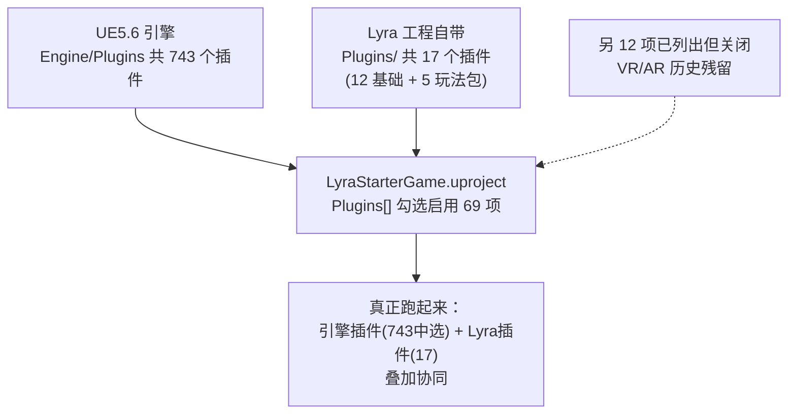

# 01b — 插件总数大盘点：UE5 和 Lyra 到底各有多少个插件？

> **定位**：`01` 讲了 `.uproject` 怎么写，`01a` 逐个讲了 Lyra 用到的插件。这一篇回答两个数字问题：**UE5.6 引擎自带的插件一共有多少个？Lyra 这个工程自带的又有多少个？**
>
> **数据来源**：本篇数字全部来自本机实测（数 `.uplugin` 文件，见文末"怎么数出来的"），不是网上估的。

---

## 一、先给结论

| 口径 | 数量 | 说明 |
|---|---|---|
| **UE5.6 引擎自带插件** | **743** | `D:\ue5\Epic Games\UE_5.6\Engine\Plugins\` 下所有 `.uplugin` |
| **Lyra 工程自带插件** | **17** | `LyraStarterGame\Plugins\` 下所有 `.uplugin`（含 GameFeatures 里的 5 个玩法包） |
| **Lyra 在 `.uproject` 里显式启用的插件** | **81 项列出 / 69 项启用** | 其中绝大多数来自上面 743 个引擎插件，真正 Lyra 自带的只占 15 项（见 `01a`） |

> **一句话**：UE5.6 光引擎就自带 **743** 个插件；Lyra 自己写的只有 **17** 个，其余全靠"打开引擎插件开关"。

---

## 二、为什么 Lyra 只写了 17 个，却能显得"功能爆炸"

先分清两个容易混的词（复习 `01` 篇）：

- **Plugin（插件）** = 一坨带 `.uplugin` 清单的功能包，装好后可用开关启用。
- **Module（模块）** = 代码组织单元，一个插件里能装好几个模块。

Lyra 能做出 GAS 战斗、模块化玩法、EOS 联机，靠的不是自己写 700 个插件，而是：

```
引擎自带 743 个插件（装好 UE 就有）
        │
        ▼
LyraStarterGame.uproject 在 Plugins[] 里勾选 81 项  ← 只是"开开关"
        │
        ▼
真正 Lyra 自己写的只有 17 个（CommonXxx UI 框架 / 消息总线 / 5 个玩法包）
```

| 你听到的功能 | 用的是谁 | 谁写的 |
|---|---|---|
| 战斗、伤害、属性 | `GameplayAbilities` | **引擎**（743 里第 1 个就够） |
| 玩法动态加载 | `GameFeatures` | **引擎** |
| 选模式进图玩到的内容 | `ShooterCore` / `TopDownArena` 等 | **Lyra 自己**（17 个里的 5 个） |
| UI 分层、登录、设置 | `CommonGame` / `CommonUser` / `GameSettings` | **Lyra 自己** |

---

## 三、那 743 个引擎插件都装在哪里、分几类？

引擎插件并不是"全都 1 个萝卜 1 个坑"，它们按目录分门别类：

| 引擎内目录 | 大致类别 | 例子 |
|---|---|---|
| `Runtime/` | 运行时通用功能（最大的类） | GAS、Niagara、EnhancedInput、CommonUI |
| `Editor/` | 只在编辑器用的工具 | ModelingToolsEditorMode、MovieRenderPipeline |
| `Online/` | 联机全家桶 | EOS、Steam、PlayFabParty |
| `Animation/` | 动画相关 | ControlRig、IKRig、PoseSearch、MotionWarping |
| `AI/` | AI 相关 | MassAI、MLAdapter、AISupport |
| `Experimental/` / `Beta/` | 实验 / 测试期功能 | 名字带 Experimental 的 |
| `Developer/` | 源码/编译工具 | 各 IDE 源码接入、SVN/Perforce |
| `2D/` `Media/` `Enterprise/` `Marketplace/` | 2D、媒体、企业、商城的 | Paper2D、Pixel Streaming… |

> 你以为引擎是"一个整体"，其实它是 743 个可拆卸积木拼起来的。这也是为什么 .uproject 必须列出每个要用的插件——引擎默认并不会全开（全开内存与编译都要炸）。

---

## 四、Lyra 的 17 个插件构成（具体名单）

```
Plugins/（12 个 Lyra 自己写的）
├── AsyncMixin                 UI 异步工具
├── CommonGame                 游戏框架：UI 分层/激活
├── CommonLoadingScreen        加载画面
├── CommonUser                 账号/用户管理
├── GameplayMessageRouter      消息总线
├── GameSettings               设置系统
├── GameSubtitles              字幕
├── LyraExampleContent         示例美术内容
├── LyraExtTool                编辑器小工具
├── ModularGameplayActors      模块化角色基类
├── PocketWorlds               口袋世界
└── UIExtension                UI 扩展槽

Plugins/GameFeatures/（5 个 = Lyra 的"玩法包"）
├── ShooterCore                射击玩法核心
├── ShooterMaps                射击地图
├── ShooterExplorer            自由探索/测试入口
├── ShooterTests               自动化测试内容
└── TopDownArena               俯视角竞技场玩法
```

> 注意：`LyraExampleContent` 和 `LyraExtTool` 也放在 Plugins 目录里，但没在 `.uproject` 里注册启用——分别由内容/编辑器按需引用，这就是前面 `01` 说的"Plugins 数组 ≠ 目录里所有插件"。

---

## 五、怎么数出来的（自查方法）

Windows 下两条 PowerShell 命令，数任何工程/引擎的插件数：

```powershell
# 数引擎自带插件（改成你自己的 UE 路径）
(Get-ChildItem -Path 'D:\ue5\Epic Games\UE_5.6\Engine\Plugins' -Recurse -Filter *.uplugin -File | Measure-Object).Count   # = 743

# 数某个工程自带的插件（改成工程路径）
(Get-ChildItem -Path 'E:\code\lyra_fifty_six\LyraStarterGame' -Recurse -Filter *.uplugin -File | Measure-Object).Count     # = 17
```

---

## 六、总结图



**一句话记忆**：**UE5.6 = 743 个自带插件**（通用能力的"零件库"）；**Lyra = 17 个自写插件**（自家框架 + 玩法包）；`.uproject` 就是把两者勾到一起的"清单"。
